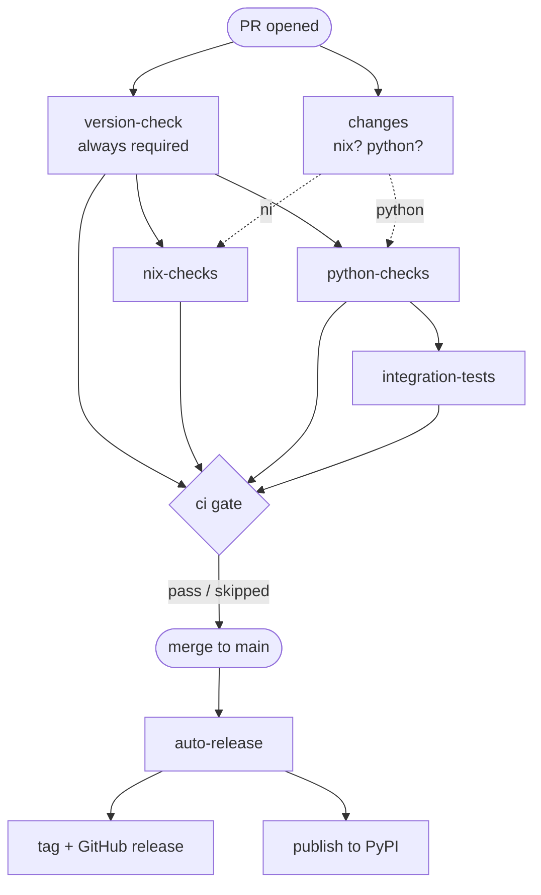

# Contributing

## Development environment

This project uses [Nix](https://nixos.org/) flakes, [uv](https://docs.astral.sh/uv/), and [direnv](https://direnv.net/).

### Prerequisites

- Nix with flakes enabled
- direnv hooked into your shell
- An AWS SSO profile with `secretsmanager:GetSecretValue` access to the `fred/api-key` secret in the `otto-dev` account

### First-time setup

1. Clone the repo and `cd` into it
2. Create `.env.local` and set your AWS profile:
   ```bash
   export AWS_PROFILE=<your-aws-sso-profile>
   ```
3. Log in to AWS: `aws sso login`
4. Allow direnv: `direnv allow`

direnv activates the Nix dev shell, runs `uv sync`, activates the Python venv, and exports `FRED_API_KEY` automatically.

## Running tests

```bash
# Unit and contract tests (no API key required)
pytest -m "unit_test or contract_test"

# All tests including integration (requires FRED_API_KEY)
pytest
```

### Test tiers

- **Unit tests** (`-m unit_test`) — no external dependencies
- **Contract tests** (`-m contract_test`) — assert on specific values (enum members, field names); no API key needed
- **Integration tests** (`-m integration_test`) — make live requests to the FRED API; require `FRED_API_KEY`

## Pre-commit hooks

[prek](https://github.com/j178/prek) manages hooks. Run `prek install` after cloning to activate them.

- **Pre-commit**: whitespace/file checks, Nix checks (nixfmt, statix, deadnix), Python checks (ruff, ty), unit and contract tests
- **Pre-push**: `uv sync`

## Workflows

GitHub Actions handles CI on every PR and release on merge to `main`. No manual steps are required after PR approval and merge.

### CI (`.github/workflows/ci.yml`)

Runs on every pull request:

- **version-check** — always runs first and is required. Fails if `pyproject.toml`'s version is already tagged on the remote, so every PR must bump the version.
- **changes** — detects whether the PR touches Nix or Python paths.
- **nix-checks** — runs only if `*.nix` or `flake.lock` changed.
- **python-checks** — runs only if `*.py`, `pyproject.toml`, or `uv.lock` changed (ruff check/format, ty, unit + contract tests).
- **integration-tests** — runs after `python-checks` passes; gated by the `integration` environment and hits the live FRED API.
- **ci** — final gate; passes when all required jobs pass or are skipped.

### Auto-release (`.github/workflows/auto-release.yml`)

Runs on every push to `main` (i.e. after a PR merges):

1. Reads the version from `pyproject.toml`
2. Creates the `v<version>` tag and GitHub release with autogenerated notes
3. Builds and publishes to PyPI via the `pypi` environment (trusted publishing)

### Flow



### Other workflows

- **update-flake-lock** (`.github/workflows/update-flake-lock.yml`) — scheduled daily; opens a PR with a `flake.lock` update and patch version bump.

## Project structure

```
src/fred/
├── enums/          # Shared enums (FileType, SortOrder, etc.)
├── functions/      # Utility functions (for_request, today_st_louis, etc.)
└── types/          # Per-endpoint subpackages (RequestParams, Response, etc.)

tests/
├── fred_test/      # Unit and contract tests
└── integration_test/  # Integration tests
```

## Adding a new endpoint

Each endpoint lives under `src/fred/types/<endpoint_name>/` and exposes:

- `request_params.py` — `RequestParams(BaseModel)`
- `response.py` — `Response(BaseModel)`
- `__init__.py` — re-exports `RequestParams`, `Response`, `ENDPOINT`, and any enums

Register the new module in `src/fred/types/__init__.py` and `src/fred/__init__.py`.
