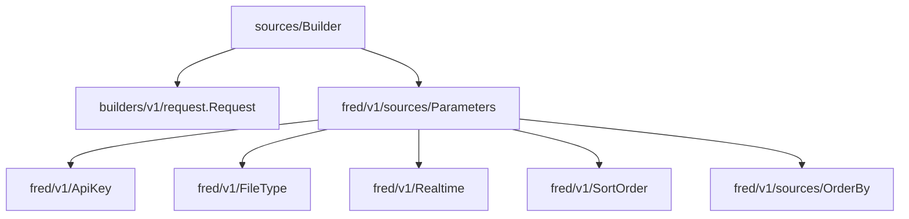

# builders/v1

Builders for the [FRED API v1](https://fred.stlouisfed.org/docs/api/fred/) endpoints.

Each builder constructs a `Request` — a frozen object containing a `url` and a `params: dict[str, str]` — ready to pass directly to any HTTP client (`requests`, `httpx`, `aiohttp`, etc.).

## Request

`builders.v1.request.Request` is shared across all builders:

| Field | Type | Description |
|---|---|---|
| `url` | `str` | The endpoint URL |
| `params` | `dict[str, str]` | Query parameters, all values as strings |

## Builders

- [sources](https://fred.stlouisfed.org/docs/api/fred/sources.html): `builders.v1.sources.Builder`

## Usage

```python
from builders.v1.sources import Builder
from fred.v1.file_type import FileType

request = (
    Builder(api_key="your-key")
    .with_file_type(FileType.json)
    .with_limit(10)
    .build()
)

# request.url   → "https://api.stlouisfed.org/fred/sources"
# request.params → {"api_key": ..., "file_type": "json", "limit": "10", ...}
```

## Dependencies


