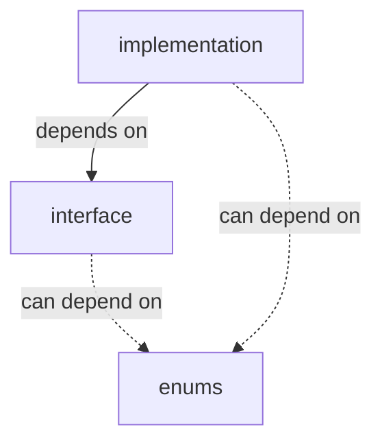

# request

This is the module for creating requests you can pass to the FRED API:

- `interface` contains classes defining behaviour
- `implementation` contains classes satisfying the behaviour defined in `interface`
- `enums` contains enums that can be used anywhere in the module

## Dependencies

