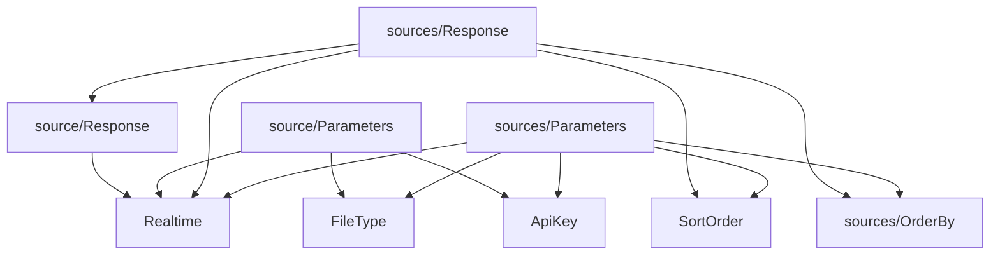

# v1

This directory contains code related to [FRED API Version 1](https://fred.stlouisfed.org/docs/api/fred/).

Top-level code are shared types (e.g. `ApiKey`), while directories are named for particular data sets (e.g. `sources`).

Documentation

- [source](https://fred.stlouisfed.org/docs/api/fred/source.html)
- [sources](https://fred.stlouisfed.org/docs/api/fred/sources.html)

Dependencies

