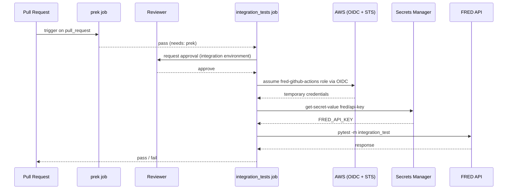

# tofu

OpenTofu configuration for the `fred` repository's GitHub and AWS infrastructure.

## What this manages

- **GitHub Actions environment** (`integration`): gates access to AWS credentials behind a reviewer approval step
- **Environment variable** (`AWS_ROLE_ARN`): the IAM role ARN that the `integration_tests` CI job assumes via OIDC

## State

Remote state is stored in S3 (`ojhermann-tofu-state-dev` bucket, key `fred/terraform.tfstate`) with DynamoDB locking.

## Usage

```bash
tofu init
tofu plan
tofu apply   # ask Otto to run after merging
```

## CI

The `integration_tests` job in `.github/workflows/ci.yml` runs after `prek` passes. It authenticates to AWS using OIDC, fetches `FRED_API_KEY` from Secrets Manager, and runs the integration test suite.

Because the job is scoped to the `integration` environment, a reviewer must approve each run before it executes — preventing untrusted code from accessing AWS credentials.


